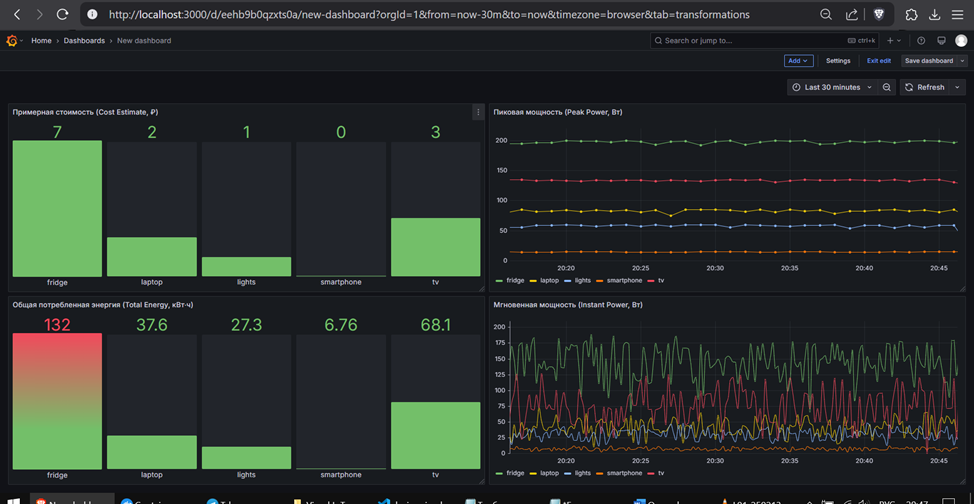

# Отчет о настройке системы мониторинга IoT устройств для отслеживания энергопотребления

## Подготовительные действия

1. **Устанавливаем Docker Desktop для Windows**:
    - Скачиваем Docker Desktop с [официального сайта](https://www.docker.com/products/docker-desktop/).
    - Следуем инструкциям установщика.
    - Активируем WSL 2 (Windows Subsystem for Linux).
    - Перезагружаем компьютер.

   *Docker необходим для контейнеризации всех компонентов системы, что обеспечивает их изоляцию и упрощает развертывание.*

2. **Устанавливаем Python**:
    - Скачиваем и устанавливаем Python 3.x с [официального сайта](https://www.python.org/).
    - Отмечаем опцию **Add Python to PATH** для доступа к Python из командной строки.

   *Python требуется для запуска симулятора IoT устройств, который будет генерировать данные энергопотребления.*

---

## Создание структуры проекта

1. **Создаем структуру директорий**:
    ```bash
    mkdir iot-monitoring
    cd iot-monitoring
    ```
   *Организованная структура директорий необходима для поддержания порядка в проекте и корректной работы Docker Compose.*

2. **Создаем файл `docker-compose.yml`**:
    - Создаем файл `docker-compose.yml` в корневой папке.
    - Копируем содержимое Docker Compose из интерфейса приложения.

   *Docker Compose файл определяет все сервисы системы (Mosquitto, Telegraf, InfluxDB, Grafana) и их взаимодействие.*

3. **Настраиваем Mosquitto MQTT брокер**:
    ```bash
    mkdir -p mosquitto/config
    mkdir -p mosquitto/data
    mkdir -p mosquitto/log
    ```
    - Создаем файл `mosquitto/config/mosquitto.conf` с базовыми настройками.

   *Mosquitto выступает в роли MQTT брокера, который принимает сообщения от IoT устройств и перенаправляет их подписчикам (в нашем случае — Telegraf).*

4. **Подготавливаем конфигурацию Telegraf**:
    ```bash
    mkdir -p telegraf
    ```
    - Создаем файл `telegraf/telegraf.conf` с настройками из интерфейса приложения.

   *Telegraf выполняет функцию сборщика данных, который подписывается на MQTT топики, получает данные от устройств и преобразует их в формат, понятный для InfluxDB.*

5. **Создаем директории для InfluxDB и Grafana**:
    ```bash
    mkdir -p influxdb/data
    mkdir -p influxdb/config
    mkdir -p grafana/data
    mkdir -p grafana/provisioning
    ```
   *InfluxDB хранит временные ряды данных энергопотребления, а Grafana обеспечивает их визуализацию. Обе системы требуют постоянного хранилища для сохранения данных и настроек.*

6. **Создаем скрипт симулятора устройств**:
    - Создаем файл `device_simulator.py`.
    - Копируем код симулятора из интерфейса приложения.

   *Симулятор необходим для генерации тестовых данных, имитирующих работу реальных IoT устройств, отправляющих данные о потреблении энергии.*

---

## Запуск и настройка системы

1. **Запускаем Docker контейнеры**:
    ```bash
    docker-compose up -d
    ```
   *Команда запускает все компоненты системы в фоновом режиме, создавая полноценную инфраструктуру мониторинга.*

2. **Устанавливаем Python зависимости для симулятора**:
    ```bash
    pip install paho-mqtt
    ```
   *Библиотека `paho-mqtt` позволяет Python-скрипту отправлять данные по протоколу MQTT в брокер Mosquitto.*

3. **Запускаем симулятор устройств**:
    ```bash
    python device_simulator.py
    ```
   *Активация симулятора начинает генерацию и отправку данных энергопотребления в систему для их последующего сбора и анализа.*

---

## Настройка визуализации данных

1. **Настраиваем InfluxDB**:
    - Переходим по адресу: http://localhost:8086.
    - Входим, используя учетные данные из `docker-compose.yml`.
    - Вводим:
        - Имя пользователя: `admin`
        - Пароль: `password123`
        - Организацию: `iot_org`

   *Первоначальная настройка InfluxDB необходима для создания хранилища временных рядов, куда Telegraf будет записывать собранные данные.*

2. **Настраиваем Grafana для работы с InfluxDB**:
    - Переходим по адресу: http://localhost:3000.
    - Входим, используя стандартные учетные данные: `admin/admin`.
    - При первом входе меняем пароль.
    - Переходим в раздел **Configuration** → **Data Sources**.
    - Нажимаем **Add data source**.
    - Выбираем **InfluxDB**.
    - Настраиваем соединение, указывая:
        - **Query Language**: **Flux**.
        - **URL**: `http://influxdb:8086`.
        - **Organization**: `iot_org`.
        - **Token**: `my-super-secret-token`.
        - **Default Bucket**: `energy_data`.
    - Нажимаем **Save & Test**.

   *Подключение Grafana к InfluxDB позволяет создавать интерактивные дашборды для визуализации данных энергопотребления.*

3. **Создаем дашборд в Grafana**:
    - Переходим в раздел **Dashboards** → **New** → **New Dashboard** → **Add a new panel**.
    - Настраиваем запрос Flux:
        ```flux
        from(bucket: "energy_data")
          |> range(start: -1h)
          |> filter(fn: (r) => r._measurement =~ /power/)
          |> aggregateWindow(every: 10s, fn: mean)
        ```
    - Настраиваем визуализацию и сохраняем дашборд.

   *Дашборд визуализирует собранные данные, что позволяет анализировать паттерны энергопотребления и выявлять аномалии.*

---

## Взаимосвязь компонентов системы



**Компоненты системы**:
1. **Симулятор устройств (`device_simulator.py`)**:
    - Генерирует данные об энергопотреблении.
    - Отправляет данные в формате JSON через MQTT.

2. **Mosquitto MQTT брокер**:
    - Принимает сообщения от симулятора.
    - Управляет топиками и маршрутизацией сообщений.

3. **Telegraf**:
    - Собирает данные из MQTT.
    - Преобразует данные в формат временных рядов.
    - Отправляет данные в InfluxDB.

4. **InfluxDB**:
    - Хранит данные в бакетах.
    - Обеспечивает доступ через язык запросов Flux.

5. **Grafana**:
    - Визуализирует данные через дашборды.
    - Поддерживает настройку оповещений.

*Система представляет собой полноценный конвейер обработки данных: от генерации через сбор, хранение и визуализацию.*
